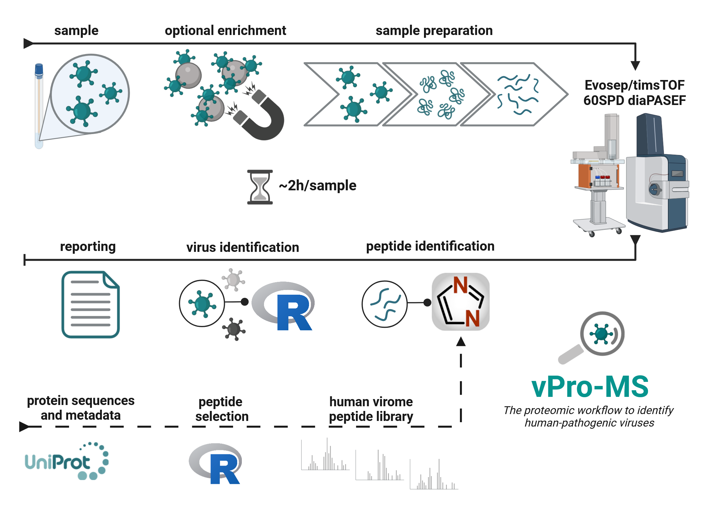

# vPro-MS
Untargeted viral proteomics workflow for the identification of human-pathogenic viruses

# Overview
This script of the viral proteomics workflow (vPro-MS) enables identification of human-pathogenic viruses from patient samples by untargeted proteomics. vPro-MS is based on an in-silico derived peptide library covering the human virome in [UniProtKB](https://www.uniprot.org/) (331 viruses, 20,386 genomes, 121,977 peptides).  The script is intended to identify human-pathogenic viruses from DiaNN (https://github.com/vdemichev/DiaNN) outputs of either DIA or diaPASEF data. A scoring algorithm (vProID) assesses the confidence of virus identification and the results are finally summarized in a report table.


Created in BioRender. Grossegesse, M. (2024) BioRender.com/s15u220

# Installation
## System Requirements
### Hardware Requirements
The software was developed on tested on a virtual machine with: 2x AMD CPU 2,96GHz and 8 GB RAM running on a Windows 10 Enterprise operating system.
### Software Requirements
The software was developed and tested with
- R (version 4.3.0)
- R package tidyverse (version 2.0.0)
- R package xfun (version 0.4.0)
- R package devtools (version 2.4.5)

## Data Sources
### Library
The vPro Peptide Library can be downloaded from zenodo (https://zenodo.org/records/13832021). The zip folder contains 3 peptide FASTA files (Contaminants.fasta, Human.fasta, vPro.Virus.fasta), which were used to predict the spectral library (vPro-lib.predicted.speclib). Please note, that the additional commands “--cut” and “--duplicate-proteins” are needed to reprocess the prediction in DiaNN. This spectral library should be used to identify peptide sequences from samples of human origin using DiaNN. Furthermore, the folder contains the metadata file of the viral peptide sequences (vPro.Peptide.Library.txt) and a summary file of the virus taxonomy covered by the library (Taxonomy.Summary.txt). The metadata file is used by this vPro script to identify viruses from the DiaNN main report.

### Output file Dia-NN
Generated using DIA-NN (https://github.com/vdemichev/DiaNN)

## Installation Guide
1. Get vPro-MS
    ```
    git clone https://github.com/RKI-ZBS/vPro-MS.git
    ```
2. Install R and its packages
    Get and install R-version from https://www.r-project.org/
    ```
    CLI>R
    R>install.packages("tidyverse")
    R>install.packages("xfun")
    R>install.packages("devtools")
    R>devtools::install("./vPro-MS")
    R>quit(save="no")
    ```    
3. Download necessary peptide libraries
    ```
    wget https://zenodo.org/records/13832021/files/vPro-MS%20Library%201.0.zip?download=1
    unzip vPro-MS%20Library%201.0.zip?download=1
    ```
  
## Demo und Tests
```
R
R>library("vPro")
R>setwd("./vPro-MS/demo/")
R>assign_viral_species(file_peptides = "DiaNN main report.tsv",
    file_virusDB = "vPro.Peptide.Library.txt",
    file_export = "new_results.tsv",
    nr_human_peptides = 591159,
    fdr = 0.01,
    min_pep_species = 2,
    min_pep_subspecies = 2,
    min_vProIDScore = 2,
    topn_precursor = 3,
    filter_vProIDScore = TRUE)
R>quit(save="no")
```
The demo input files are available within the demo directory. The script should run within a second and the output of the script can be compared to results.tsv.

# Usage
## Small Examples
```
library(vPro)
setwd("C:/Home/Users/ProjectA/assignSpecies")
assign_viral_species(file_peptides = "report_VirusID_Specificity.tsv",
                     file_virusDB = "Viral.Peptide.Library.txt",
                     file_export = "results_virusID.tsv",
                     nr_human_peptides = 591159,
                     fdr = 0.01,
                     min_pep_species = 2,
                     min_pep_subspecies = 2,
                     min_virIDScore = 2,
                     topn_precursor = 3,
                     filter_virIDScore = TRUE)
```
## Input and Arguments
Argument | Description | Example
--- | --- | ---
file_peptides | DiaNN main output file containing the identified precursors | report_VirusID_Specificity.tsv
file_virusDB | vPro Peptide Library | Viral.Peptide.Library.txt
file_export | Output file of vPro-MS Virus Identification | results_virusID.tsv
nr_human_peptides | Number of human peptides in the library | 591159
fdr | FalseDiscoveryRate for peptide identification | 0.01
min_pep_species | minimal number of identified peptides necessary for a species assignment | 2
min_pep_subspecies | minimal number of identified peptides necessary for a subspecies assignment | 2
min_virIDScore | vProID score necessary for taxonomic assignment | 2
topn_precursor | number of most abundant precursor that are used for quantification | 3
filter_virIDScore | should the results be filtered according to vProIDScore (Boolean) | TRUE

## Output
The vPro script summarizes virus identification results in a single report table (Results_vPro.txt). The results represent an independent analysis of each sample in the DiaNN main report. The virus identifications are already filtered according to the thresholds configured in the vPro script. The report consists of the following columns:

Column | Description | Example
--- | --- | ---
Run | Name of the sample | VirusID_Specificity_T15
Species | Virus species identified (NA = no identification) | Human coronavirus NL63
vProID.Score | vProID score | 3.7046550047138
No.Peptide.Sequences | Number of peptide sequences unique to the virus species | 27
Virus.Quantity | Quantity of the virus species calculated using the Top3 approach for absolute protein quantification | 213596.333333333
Peptide.Sequences | Viral peptide sequences | DEQIGYWNVQER;EMQSQSSHAVQNTVLNASIPESK;FIEQISAFTK
CScores | CScores of each virus peptide as reported by DiaNN | 0.998553;0.996127;0.993292
Subspecies | Virus subspecies identified | NA
No.Peptide.Sequences.Subspecies | Number of peptide sequences unique to the virus subspecies | NA
Proteomes | Uniprot proteome accession number(s) for the top ranked virus proteome(s) | UP000173136;UP000105969: Genome

# Reference
Grossegesse, M.; Horn, F.; Kurth, A.; Lasch, P.; Nitsche, A.; Doellinger, J. vPro-MS enables identification of human-pathogenic viruses from patient samples by untargeted proteomics. medRxiv 2024, https://doi.org/10.1101/2024.08.21.24312107

# License
MIT License

# Support
Please post any questions, feedback, comments or suggestions on the GitHub Discussion board.
